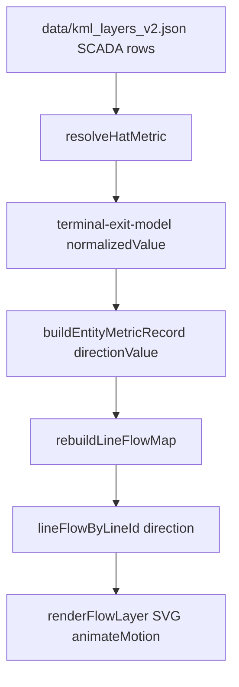

# Amaç

`Haritada Göster` sekmesinde SCADA hat akış yön oklarının yanlış yönde çizilme riskini kökten gidermek; builder/runtime/audit kararlarını aynı yön modeliyle tutarlı hale getirmek; fiziksel yüklenme hesabı ve SCADA panel UX hatalarını düzeltmek.

# Mevcut Durum ve Bulgular

## README.md “Kritik Güncel Durum” özeti

- Ana harita runtime’ı V2 modele taşınmış; temel veri kaynağı `data/kml_layers_v2.json`.
- Hat/TM/trafo/bara yapıları V2 modelden çalışıyor.
- SCADA hat yönü, eşleşme kalitesi, audit/mismatch raporları ve görünür özetler V2 akışa bağlanmış.
- Hat renklendirme, popup ve liste aynı çözülmüş metric kaynağını kullanıyor.
- Hover, overlay, declutter ve otomatik yenileme tarafında güncel iyileştirmeler var.
- README’nin ileri geliştirme başlıkları bu görevle doğrudan ilişkili: snapshot kalıcılığı, audit kalıcılığı, alias/manual override, cache restore, SCADA fetch kontratının tekilleştirilmesi.

## `docs/yon_analiz.md` Bug 1-7 özeti

1. Builder polarizasyon kuralı fazla sert: `formulaSign == polarizationSign` olmadığı için özellikle `end` terminal + `(+1)` formüller “polarizationMismatch” sayılıyor.
2. `computeLoadingMagnitude` reaktif ölçüm yoksa `1` ekliyor; fiziksel olarak hatalı, `0` olmalı.
3. `resolvedTerminalMismatch` harita/audit akışında tutarsız raporlanıyor.
4. Legacy `scada-client.js` yön hesabı ile V2 runtime yön hesabı farklı.
5. Aynı `measurementId` için çift formül/variant kaynaklı ambiguity riski var.
6. Bayat/gecikmeli veri UI’da dar kolon ve ellipsis nedeniyle yeterince görünmeyebiliyor.
7. Reaktif modda renk/genişlik eşiği aktif yüklenme mantığına fazla bağlı kalabiliyor.

# Kök Neden Analizi

## 1. Terminal-exit modeli ve polarizasyon tutarsızlığı

### Builder davranışı

`build_kml_layers_v2.py` içinde hat adayı zenginleştirilirken:

- `terminalSide = start` ise `polarizationSign = +1`
- `terminalSide = end` ise `polarizationSign = -1`
- `polarizationConsistent = formulaSign == polarizationSign`

Bu yüzden şu desen otomatik mismatch oluyor:

- ölçüm terminali: `end`
- builder polarizasyonu: `-1`
- formül: `(+1) END_TM, ..., START_TM, P/Q`
- sonuç: `polarizationConsistent = false`

Bu durum veri modelinde yaygın. `data/kml_layers_v2.json` validation özetinde:

- `terminalSideResolved`: `8515`
- `terminalSideUnknown`: `0`
- `polarizationMismatch`: `4117`

Yani terminal tarafı çözülmüş olmasına rağmen yaklaşık yarısı `formulaSign` ile terminal polarizasyonu farklı olduğu için mismatch sayılıyor. Bu, tek başına fiziksel yönün çözülemediği anlamına gelmiyor.

### Örnek tutarsız hat desenleri

Bu örneklerde `start -> end` YTBS referans yönü, `end` terminal ölçümü `(+1)` formülle geliyor ve builder bunu mismatch sayıyor:

- `400kV DAVUTPAŞA - YILDIZTEPE EİH`
  - `startTm`: DAVUTPAŞA
  - `endTm`: YILDIZTEPE
  - end terminal formülü: `(+1) YILDIZTE, 380, DAVUTPAS, P/Q`
  - `terminalSide=end`, `polarizationSign=-1`, `formulaSign=+1`
- `154kV AYANCIK - SİNOP EİH`
  - end terminal formülü: `(+1) SINOP, 154, AYANCIK, P/Q`
- `154kV ILICA ZEKİ GÜRGEN - AŞKALE EİH`
  - end terminal formülü: `(+1) ASKALE, 154, ERZURUM-2, P/Q`
- `154kV ERZİNCAN - ERGAN EİH`
  - end terminal formülü: `(+1) ERGAN, 154, ERZINCAN, P/Q`
- `154kV ERGAN - REFAHİYE EİH`
  - end terminal formülü: `(+1) REFAHIY, 154, ERGAN, P/Q`
- `154kV VARSAK - AKORSAN - II EİH`
  - end terminal formülü: `(+1) AKORSAN, 154, VARSAK-2, P/Q`
- `400kV ALİAĞA2 - İZMİR DGKÇ - I/II EİH`
  - end terminal formülü: `(+1) IZMIRDG, 380, ALIAG2-1/2, P/Q`

Bunlar kesin “haritada ters çiziliyor” demek değildir; “builder mismatch sayıyor, runtime terminal-exit ile çözebilir” sınıfıdır. Gerçek ters çizim kararı canlı `rawValue`, seçilen aday ve `lineFlowByLineId.direction` üzerinden oluşur.

## 2. Runtime bunu nasıl çözüyor?

`scada-v2-runtime.js` içinde V2 runtime, terminal metadata varsa formül işaretini yön normalizasyonunda ana kaynak yapmıyor:

- `candidatePolarizationSign = +1` (`start`) veya `-1` (`end`)
- `normalizedValue = rawValue * candidatePolarizationSign`
- `directionValue = normalizedValue`
- `direction = directionValue >= 0 ? forward : reverse`
- `directionResolvedBy = terminal-exit-model`
- `polarizationConsistent === false` ise `resolvedTerminalMismatch = true`

Yani runtime’ın doğru varsayımı şu: “pozitif ham değer ölçümün bağlı olduğu terminalden çıkış” ise, end terminalde pozitif değer `end -> start` olmalıdır ve `rawValue * -1` ile referans eksene çevrilir.

## 3. Haritada ok hangi kararla çiziliyor?

Harita okları doğrudan builder’daki `polarizationConsistent` değerine göre çizilmiyor. Akış şu şekilde:

- Nihai harita kararı `state.scada.lineFlowByLineId` içindeki `flow.direction` alanından gelir.
- `flow.direction`, `record.directionValue` veya `primaryValue` işaretine göre üretilir.
- `renderFlowLayer` detaylı modda `reverse` için koordinatları ters çevirir.
- V2 override’da sade/sade-ayrık mod için `buildRenderedFlowPath` ters çevirme yapmıyor; bu özellikle sade modda ok yönü hatasına aday bir bug’dır.

## 4. Hangileri hatalı yönde?

Salt statik modelden kesin hatalı yön listesi çıkarılamaz; çünkü ok yönü canlı `rawValue` işaretine, seçilen adaya, aday çatışmasına ve `lineFlowByLineId` içindeki nihai `direction` alanına bağlıdır. Ancak riskli/hatalı sınıflar net:

1. **Sade / sade-ayrık modda `flow.direction === reverse` olan tüm hatlar**
   - V2 `buildRenderedFlowPath` detaylı modda reverse yapıyor, sade modda path her zaman `start -> end` üretiyor.
   - Bu sınıfta oklar çok yüksek olasılıkla yanlış yönde çizilir.
2. **`resolvedTerminalMismatch=true` olup audit/uncertainty nedeniyle popup’ta “Belirsiz/Yön belirsiz” görünen ama flow map’te çizilen hatlar**
   - Harita doğru yöne yakın olabilir; rapor/UI yanlış güven mesajı verir.
3. **Legacy akışın devreye girdiği senaryolar**
   - `scada-client.js` içindeki legacy `applyScadaSnapshot` yönü `activePowerMw >= 0` ile belirliyor.
   - Terminal-exit modelini bilmediği için end-terminal ölçümlerinde ters yön üretebilir.
4. **Birden fazla adaylı hatlarda primary/secondary değerleri tolerans dışıysa**
   - Runtime bu durumda flow map’e almayarak koruma yapıyor; ancak legacy veya eski UI yolu kullanılırsa yanlış yön riski oluşur.

# Uygulama Planı

## 1. Yön modelini tek kaynaklı hale getir

### Hedef dosyalar

- `scada-v2-runtime.js`
- `scada-flow.js`
- `scada-client.js`
- `map-modern.js`
- `map-v2-runtime.js`

### İşler

- `scada-v2-runtime.js` içinde tek bir helper oluştur:
  - `getHatFlowDirection(record)` veya eşdeğeri.
  - Sadece `directionValue`/terminal-exit sonucu üzerinden `forward|reverse|unknown` dönsün.
- `rebuildLineFlowMap` bu helper’ı kullansın.
- `renderFlowLayer` yalnız `lineFlowByLineId.direction` tüketicisi kalsın; yön hesabı yapmasın.
- `scada-client.js` içindeki legacy `applyScadaSnapshot` V2 aktifken `lineFlowByLineId` üretmesin veya net guard ile kapatılsın.
- `setCapacitySeason` fallback’inde legacy `applyScadaSnapshot` çağrısına düşme koşulu daraltılsın.

### Kabul kriterleri

- V2 aktifken yön hesabı sadece `scada-v2-runtime.js` tarafından yapılır.
- Legacy `activePowerMw >= 0` yön kararı V2 harita oklarını etkileyemez.
- `directionResolvedBy=terminal-exit-model` olan kayıtlar için yön `directionValue` ile birebir tutarlıdır.

## 2. Sade mod reverse ok hatasını düzelt

### Hedef dosya

- `scada-v2-runtime.js`

### İşler

- `buildRenderedFlowPath(row, flow)` içinde sade/sade-ayrık modlar da `flow.direction === 'reverse'` olduğunda path’i `end -> start` olarak üretmeli.
- Sade-ayrık paralel hat offset’i korunmalı; offset önce start/end bazlı hesaplanıp reverse durumda çizim uçları takas edilmeli.
- Detaylı KML modundaki mevcut reverse davranışı korunmalı.

### Kabul kriterleri

- Detaylı, sade ve sade-ayrık modlarda aynı `flow.direction` aynı görsel yönü verir.
- `reverse` flow için ok animasyonu `endTm -> startTm` yönünde akar.
- Aynı iki TM arasındaki paralel hatlarda offset tersleme sonrası karışmaz.

## 3. `resolvedTerminalMismatch` audit tutarlılığını düzelt

### Hedef dosya

- `scada-v2-runtime.js`

### İşler

- `resolvedTerminalMismatch` “unresolved” değil, “resolved-with-warning” olarak sınıflandırılmalı.
- `buildHatUncertaintyMeta` bu durumu ayrı gösterse de `hasHatUncertainty` veya flow eligibility bu nedenle yönü belirsiz saymamalı.
- `buildScadaAuditReport` içine ayrı sayaç eklenmeli:
  - `resolvedTerminalMismatch`
  - `resolvedWithWarning`
- Mismatch modalında “Yön Belirsiz” ile “Terminal yorumlu çözüm” ayrılmalı.
- CSV’ye mevcut alanların yanına açık durum kolonu eklenmeli:
  - `Direction Confidence` veya `Resolution Class`
  - değerler: `resolved`, `resolved-with-warning`, `unresolved`, `conflict`, `missing`

### Kabul kriterleri

- `resolvedTerminalMismatch=true` kayıtlar `orientation-unknown` sepetine düşmez.
- Bu kayıtlar haritada çizilmeye devam eder.
- Modal/CSV kullanıcıya “formül polarizasyonu farklı, yön terminal-exit ile çözüldü” şeklinde açık ve ayrı rapor verir.

## 4. Builder validation dilini düzelt

### Hedef dosyalar

- `build_kml_layers_v2.py`
- `data/kml_layers_v2.json` üretim çıktısı
- varsa `docs/yeni_harita_modeli/*` veya validation raporu çıktısı

### İşler

- `polarizationMismatch` metriği “çözülemez hata” anlamından çıkarılmalı.
- Yeni validation ayrımı önerisi:
  - `terminalSideResolved`
  - `terminalSideUnknown`
  - `formulaTerminalSignMismatch`
  - `terminalExitResolvable`
  - `terminalExitUnresolvable`
- `polarizationConsistent=false` korunacaksa adı/yorumlaması netleştirilmeli; örn. `formulaSignMatchesTerminalPolarity`.
- Builder output’a `directionModelHint: terminal-exit-model` ve `terminalExitResolvable: true` alanı eklenmeli.

### Kabul kriterleri

- `endTm + (+1)` deseni otomatik “hata” olarak raporlanmaz.
- Validation raporu çözülmüş/çözülememiş durumları ayırır.
- Runtime ile builder aynı terminolojiyi kullanır.

## 5. Fiziksel yüklenme hesabını düzelt

### Hedef dosya

- `scada-v2-runtime.js`

### İşler

- `computeLoadingMagnitude` içinde reaktif ölçüm yoksa `reactiveForLoading = 0` yapılmalı.
- Reaktif varsa `sqrt(MW^2 + MVar^2)` korunmalı.
- Sadece reaktif varsa mevcut `reactiveMagnitude` fallback’i korunmalı.

### Kabul kriterleri

- Aktif var, reaktif yok: `loadingMagnitude = abs(MW)`.
- Aktif+reaktif var: `sqrt(MW² + MVar²)`.
- Düşük MW değerlerinde yapay `+1` MVA sapması kalkar.

## 6. Harita göster UI iyileştirmelerini uygula

### Hedef dosyalar

- `map-modern.html`
- `map-modern.css`
- `scada-v2-runtime.js`
- gerekiyorsa `scada-flow.js`

### Önerilen UI değişiklikleri

- SCADA kartında “Harita Gösterimi” segmentlerini iki gruba ayır:
  - Hat modları: `Akış`, `Isı Haritası`, `Mevcut`
  - Noktasal overlay modları: `Kutu`, `Nokta (Ad)`, `Nokta (Adsız)`, `Isı Haritası`
- SCADA kartına kalite chip’leri ekle:
  - `Canlı`, `Gecikmeli`, `Bayat`, `Yön belirsiz`, `Terminal yorumlu`, `Eksik`
- `Terminal yorumlu` chip’i tıklanınca mismatch modalı ilgili sınıfla filtrelenebilsin.
- Ranking panelinde zaman/status alanını genişlet veya iki satırlı yap:
  - saat/tarih
  - `Canlı/Gecikmeli/Bayat` chip’i
- Ok tooltip’ine yön modeli ekle:
  - `Model: terminal-exit-model`
  - `Terminal: start/end`
  - `Güven: Çözülmüş / Terminal yorumlu / Belirsiz`
- Harita üzerinde opsiyonel `YTBS referans yönü` toggle’ı ekle:
  - gri ince `startTm -> endTm` referans oku
  - canlı SCADA oku renkli üst katman

### Kabul kriterleri

- Kullanıcı `Harita Gösterimi` seçeneklerini daha az karışıklıkla görür.
- Bayat/gecikmeli/yön belirsiz durumları tabloda kesilmez.
- Operatör canlı ok yönü ile YTBS referans yönünü ayırt edebilir.

## 7. Reaktif mod renk/genişlik davranışını netleştir

### Hedef dosyalar

- `scada-v2-runtime.js`
- `scada-client.js`
- `map-modern.css`

### İşler

- Reaktif modda `displayPctMode=reactive-ratio` ise renk ve genişlik `displayPct` üzerinden hesaplanmalı.
- Aktif yüklenme ile reaktif oran lejantları ayrılmalı.
- Legacy `getFlowColor/getFlowWidth` fonksiyonları V2 `displayPct` semantiğini bozmayacak hale getirilmeli veya V2’ye özel isimlendirme yapılmalı.

### Kabul kriterleri

- `Hat (MW)` modu MVA yüklenme yüzdesiyle renklendirilir.
- `Hat (MVar)` modu MVar/MW oranı veya belirlenen reaktif metrikle tutarlı renklendirilir.
- Lejant metni seçili moda göre değişir.

## 8. Tanılama ve regresyon testleri ekle

### Hedef dosyalar

- `tests/*`
- `package.json` test scriptleri varsa mevcut yapıya bağlı kalınacak
- gerekirse küçük fixture dosyası

### Test senaryoları

- `terminalSide=start`, `rawValue>0` → `forward`
- `terminalSide=end`, `rawValue>0` → `reverse`
- `terminalSide=end`, `formulaSign=+1`, `polarizationSign=-1` → `resolvedTerminalMismatch=true`, ama `unresolved=false`
- sade mod `reverse` path’i `end -> start` üretir
- reaktif yoksa `computeLoadingMagnitude` aktif magnitüdü aynen döndürür
- `resolvedTerminalMismatch` audit’te `orientation-unknown` değil `resolved-with-warning` sınıfına girer
- V2 aktifken legacy `applyScadaSnapshot` flow map yönünü değiştirmez

### Kabul kriterleri

- Yön modeli edge case testleri yeşil.
- Harita path üretimi modlar arasında tutarlı.
- Audit/mismatch sınıfları beklenen sayaçlara gider.

# Riskler ve Notlar

- Canlı SCADA snapshot olmadan “şu an haritada ters çizilen tüm hatlar” kesin listelenemez. Statik model yalnız mismatch/riskli adayları verir. Kesin liste için runtime’da `lineFlowByLineId`, seçilen aday ve `directionValue` birlikte raporlanmalı.
- `data/kml_layers_v2.json` büyük üretim çıktısı olduğu için builder değişikliğinden sonra model yeniden üretilmeli ve diff kontrollü incelenmeli.
- Legacy kod tamamen silinmeden önce mock/eski fallback akışlarının gerçekten kullanılmadığı doğrulanmalı.

# Step → Target → Verification Eşlemesi

| Step | Target | Verification |
|---|---|---|
| Tek yön helper’ı | `scada-v2-runtime.js` | terminal start/end yön testleri |
| Sade reverse path | `scada-v2-runtime.js` render path | sade/detaylı path unit testi veya DOM smoke test |
| Audit ayrımı | `buildScadaAuditReport`, modal, CSV | resolved warning ≠ orientation unknown testi |
| Builder validation | `build_kml_layers_v2.py` | validation sayaçları ve rapor metni |
| Loading düzeltmesi | `computeLoadingMagnitude` | reaktif yoksa `abs(MW)` testi |
| UI iyileştirme | `map-modern.html/css`, runtime UI render | manuel harita smoke + responsive kontrol |
| Reaktif lejant | runtime color/legend | mod bazlı displayPct/lejant testi |
| Legacy guard | `scada-client.js`, season fallback | V2 aktifken legacy flow mutation yok testi |

# Definition of Done

- V2 yön kararı tek kaynaktan üretiliyor.
- `end` terminal `(+1)` formüller “çözülemez yön hatası” olarak raporlanmıyor.
- Sade/sade-ayrık modda reverse oklar doğru uçtan doğru uca akıyor.
- `computeLoadingMagnitude` fiziksel olarak doğru davranıyor.
- Audit/mismatch raporları `resolvedTerminalMismatch` durumunu ayrı ve anlaşılır gösteriyor.
- UI’da `Harita Gösterimi`, stale durumları ve yön güveni operatöre net sunuluyor.
- Mevcut test/lint/build kontrolleri geçiyor.